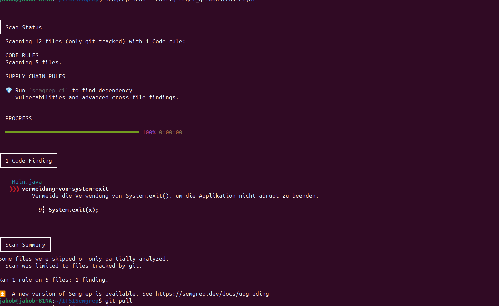
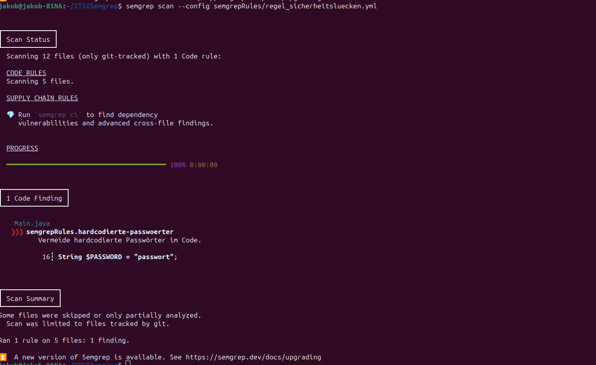

# [GK] 10.11.1 Statische Codeanalyse

@autors: Ertl Jakob, Latschbacher Lukas

## Rule 1 - Vorhandensein von Kommentaren bei public Methoden

Diese Regel überprüft ob über öffentlichen Methoden ein Kommentar ist, um diese zu erklären. Falls dies nicht der Fall ist, wird eine Warnung ausgegben.

```yml
rules:
- id: kommentare-bei-oeffentlichen-methoden
  patterns:
    - pattern: |
        public $RETURNTYPE $METHOD(...) {
          ...
        }
    - pattern-not: |
        /**
         * ...
         */
        public $RETURNTYPE $METHOD(...) {
          ...
        }
  message: "Öffentliche Methoden sollten Kommentare haben, die ihre Funktionalität erklären."
  languages: [java]
  severity: WARNING
```

## Rule 2 - Vermeidung von gefaehrlichen Konstrukten

Diese Regel überprüft ob ein gefährliches Konstrukt verwendet wird. In dem Fall haben wir System.exit() gewählt, da diese Methode direkt zum Programmabsturz führt, was nicht unbedingt gewollt ist ohne das gespeichert ist.

```yml
rules:
- id: vermeidung-von-system-exit
  pattern: System.exit($X);
  message: "Vermeide die Verwendung von System.exit(), um die Applikation nicht abrupt zu beenden."
  languages: [java]
  severity: ERROR
```

Ausführen:



## Rule 3 - Erkennung von authentifizierungs Routinen

Diese Regel erkennt Authentifizierungs Routinen und zeigt diese an, damit man die Sicherheit derer überprüfen kann.

```yml
rules:
- id: authentifizierungs-routinen
  pattern: |
    public $RETURNTYPE login($PARAMS) {
      ...
    }
  message: "Überprüfe die Sicherheit der Authentifizierungsroutine."
  languages: [java]
  severity: INFO
```

## Rule 4 - Erkennung von Sicherheitsluecken

Diese Regel erkennt die Sicherheitslücke von hardcodierten Passwörtern.

```yml
rules:
- id: hardcodierte-passwoerter
  pattern: |
    String $PASSWORD = "...";
  message: "Vermeide hardcodierte Passwörter im Code."
  languages: [java]
  severity: ERROR
```

Ausführen:



## Rule 5 - unsichere Konfigurationsoptionen

Diese Regel erkennt nicht sicher konfigurierten File Zugriff.

```yml
rules:
- id: unsichere-konfiguration
  pattern: |
    $X = new FileInputStream("$FILE");
  message: "Stelle sicher, dass der Zugriff auf Dateien sicher konfiguriert ist."
  languages: [java]
  severity: WARNING
```

## Rule 6 - unsichere Dateipfade

Diese Regel erkennt unsichere Zugriffe auf sicherheitsrelevante Dateipfade, wie etc/passwd.

```yml
- id: java-unsafe-file-paths
  patterns:
    - pattern: |
        $Path = $any;
        $Pattern.matches(".*/etc/passwd", $Path);
      message: "Unsicherer Dateipfad gefunden: möglicher Zugriff auf Passwortdateien."
  languages:
    - java
```
